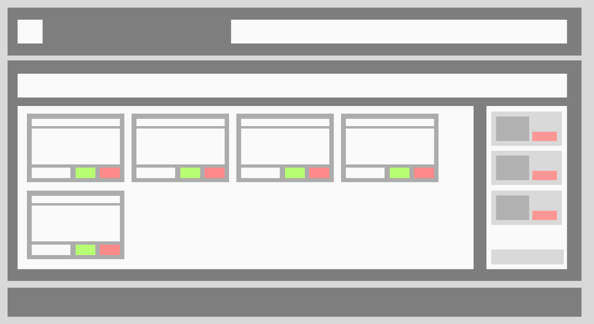
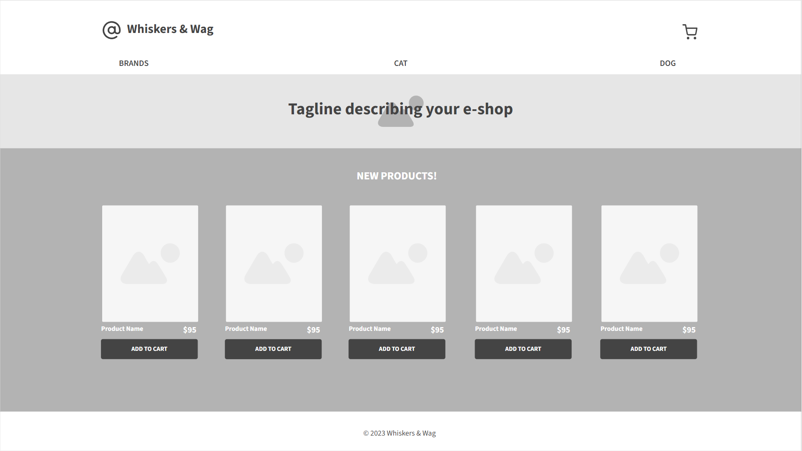
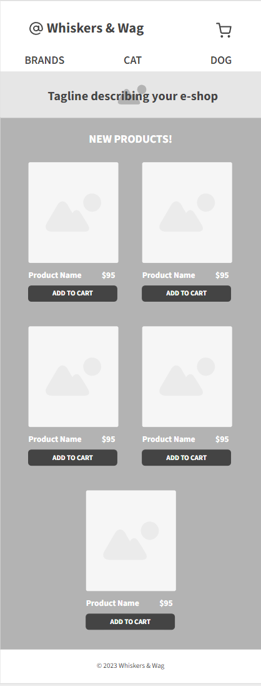
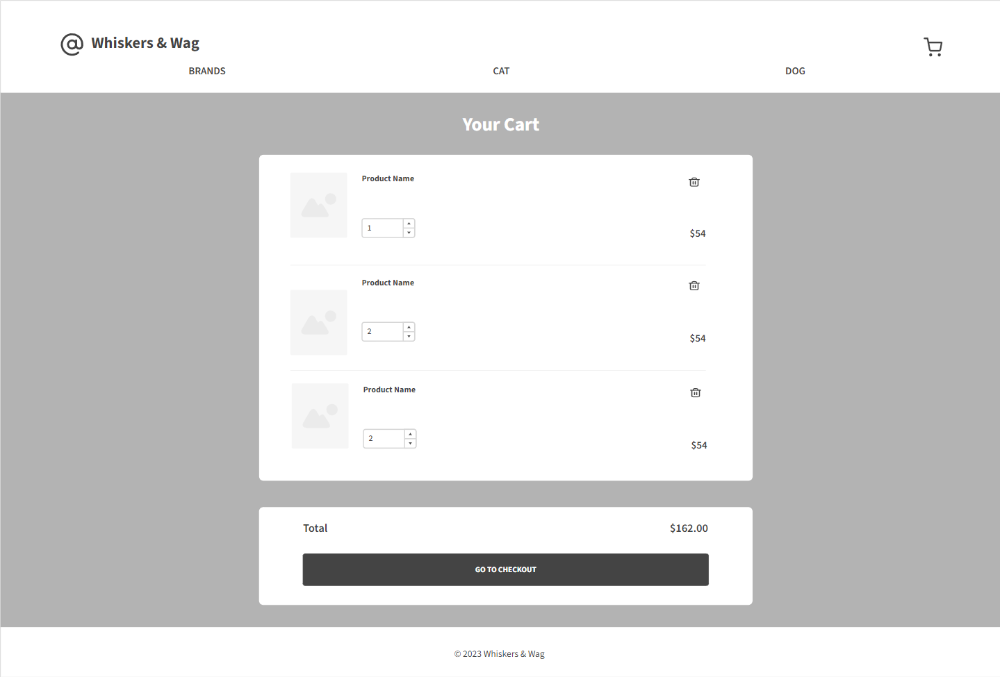
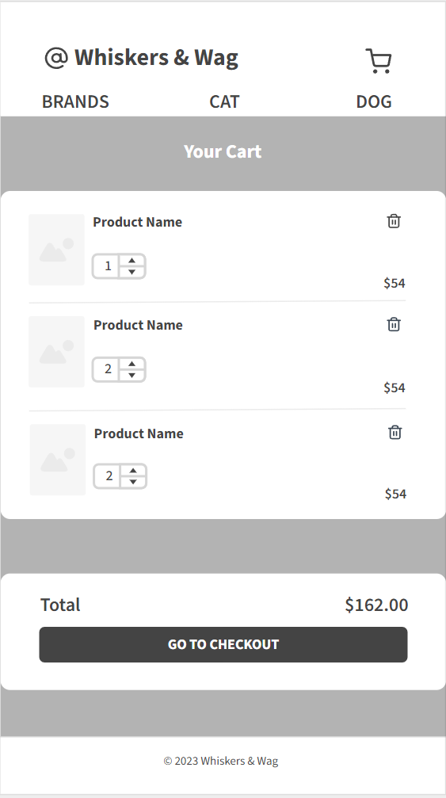
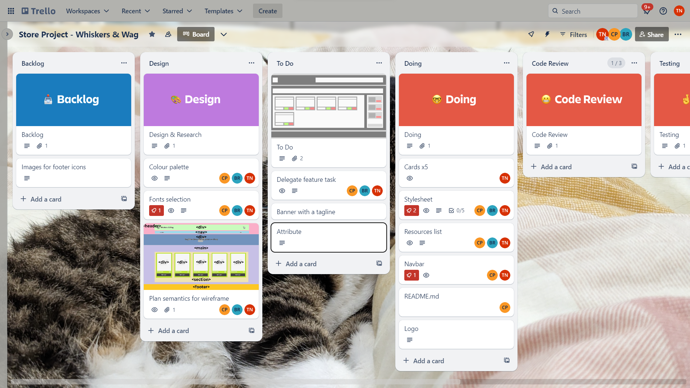

# Store Project (HTML & CSS)

## Description
This project was created for the Web Development program at Generation Australia, to demonstrate students' technical skills (HTML & CSS) and Behavioural Skills and Mindsets (communication, team work, time management, collaboration, etc.).

## Authors:
__Bradley Richards__
[GitHub](https://github.com/Frogdust "Bradley's GitHub") / <bradleyrossrichards@gmail.com>

__Gem Phan__
[GitHub](https://github.com/RainInApril "Gem's GitHub") / [LinkedIn](https://www.linkedin.com/in/chau-bao-nguyen-phan/ "Gem's LinkedIn") / <chaubnphan@gmail.com>

__Tracey Ngo__
[GitHub](https://github.com/NTracey "Tracey's GitHub") / [LinkedIn](https://www.linkedin.com/in/tracey-ngo/ "Tracey's LinkedIn") / <traceyngo4@gmail.com>

#### Our instructor/mentor - __Elias Matta__

## Our Store's Wireframe

### The store's initial wireframe:

### More detailed wireframes for home page:

#### Web's view

#### Mobile's view

### More detailed wireframes for shopping cart page:

#### Web's view

#### Mobile's view

## Features

## Trello Board
This screenshot showcases our project's Trello board, which we use to manage tasks, track progress, and collaborate in our web development project.

## Tools & Resources
We used a variety of tools and resources to collaborate, such as:
* GitHub
* Slack
* Zoom
* Visual Studio Code
* Live Share (Visual Studio Code's extension)
* draw.io
* Figma